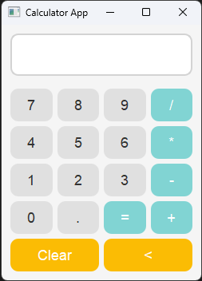
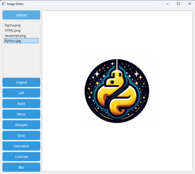
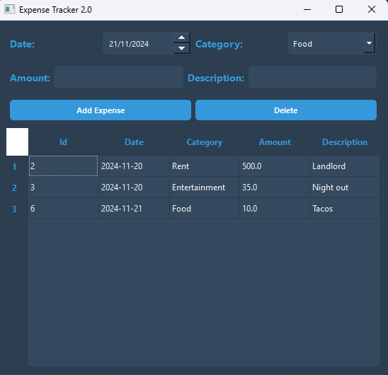

# Description
Python is a versatile and powerful language that offers several development possibilities, such as web projects, backend, desktop, data analysis, Machine Learning, and task automation. These projects were part of a Python learning journey, focusing on developing desktop applications using the PyQt5 library.

## Projects
Below are some projects already developed
- **Calculator**: A simple calculator can perform basic calculations, such as addition, subtraction, multiplication, and division, clear the screen, and delete the last digit. If an error occurs, a window will be displayed informing the reason for the error.
- **ImageEditor**: This app allows you to upload a picture and perform simple edits, such as rotating the image to the right or left, mirroring it, converting it to grayscale, applying blur, adjusting contrast, sharpening, and more.
- **Expense Tracker**: This app allows you to track your expenses by adding them and deleting them. It also displays all the expenses in a table.

## Objects Used
Below are some of the main objects and components used in the project:
- **QApplication**: *The main object managing the application lifecycle and events, handling initialization, shutdown, and user   interactions.*
- **QMainWindow**: *The application's main window, where all visual elements are placed.*
- **QWidget**: *A generic widget used to group other widgets.*
- **QVBoxLayout / QHBoxLayout**: *Layout managers to organize widgets within the window.*
- **QPushButton**: *Interactive buttons for each number and operation in the calculator.*
- **QLineEdit**: *Text input field to display numbers and calculator results.*
- **QApplication**: *The object responsible for managing the application loop and events.*
- **QPushButton**: *An interactive button for triggering specific actions in the GUI.*
- **QLineEdit**: *A text input field for capturing or displaying user input.*
- **QMessageBox**: *A dialog box for displaying messages, warnings, or errors to the user, with customizable buttons.*
- **ImageEnhance**: *A class in Pillow used to adjust properties such as brightness, contrast, sharpness, and color in images.* 
- **Image**: *The core object from the PIL (Pillow) library representing an image, with methods for processing and manipulation.* 
- **ImageFilter**: *A module in Pillow that provides predefined filters for image processing, such as blur, contour, and edge detection.* 
- **QPixmap**: *A class for displaying images in PyQt, with methods for loading, scaling, and displaying images.*
- **QTableWidget**: *A widget for displaying tabular data, with methods for adding and manipulating rows and columns.*
- **QTableWidgetItem**: *A class representing an item in a table widget, with methods for setting and retrieving data.*
- **QHeaderView**: *A class for managing the headers of a table widget, allowing customization of column headers.*
- **QSqlDatabase**: *A class for managing database connections and transactions.*
- **QSqlQuery**: *A class for executing SQL queries and interacting with databases.*
- **QDate**: * A class representing a calendar date (year, month, day), with functions for manipulation and formatting.*

## Technologies Used

- **Python**: *Programming language.*
- **PyQt5**: *Library for building graphical user interfaces.*
- **QSS**: *For interface styling.*

## Images
 
 
 

## Contribution
Contributions are welcome! Feel free to open an issue or submit a pull request with improvements and fixes.

## License
This project is licensed under the MIT License.
